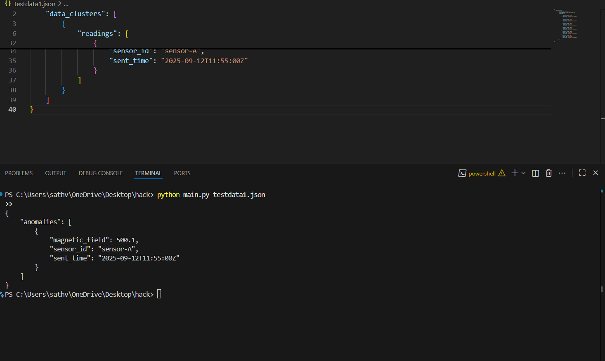
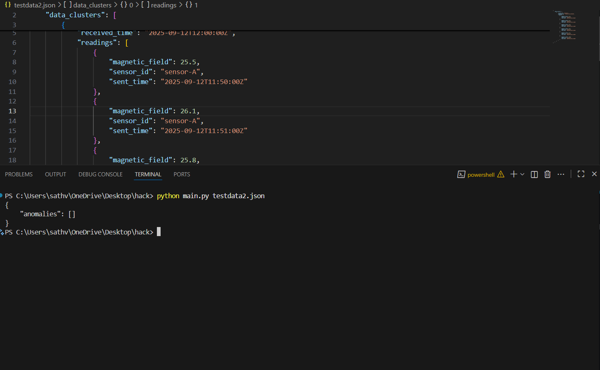
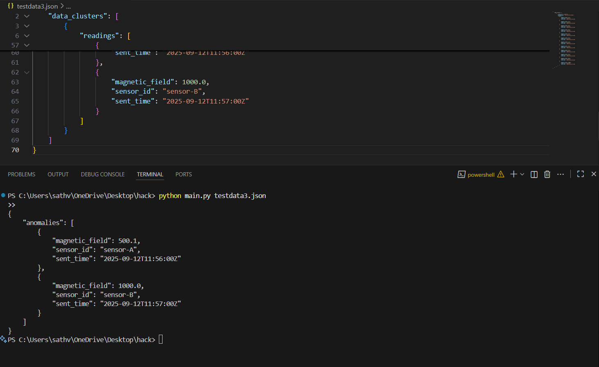

# Satellite Anomaly Detection System
## Project Overview
This Python program detects sudden, significant anomalies in magnetometer readings from a network of CubeSats. The system processes time-stamped sensor data clusters, filters stale readings, and identifies magnetic field spikes that exceed a dynamic threshold—likely indicating solar flares or sensor malfunctions.

The implementation strictly follows the specified anomaly detection rules and produces output in the required JSON format with 4-space indentation.

Implementation Details
Core Logic
Stale Data Filtering: Any reading whose sent_time is more than 30 minutes older than its cluster’s received_time is discarded.

- **Anomaly Detection:** A reading is flagged as an anomaly if its magnetic_field value is greater than 5 times the average of the previous 5 valid readings from the same sensor.

- **Rolling Window:** The system maintains a sliding window of the last 5 valid readings per sensor to compute the dynamic baseline.

- **Output:** Detected anomalies are sorted by sent_time and printed as a JSON object to standard output.

## Key Features
1.Efficient processing of multiple data clusters and sensors

2.Accurate time parsing and comparison using datetime

3.Stateful tracking of sensor history using defaultdict

4.Clean, sorted JSON output with 4-space indentation

## Usage
Run the script from the command line with the input JSON file as an argument:

python main.py <input_file.json>

## Input Format
The input JSON must contain a data_clusters array. Each cluster includes:

- **cluster_id:** Unique identifier

- **received_time:** UTC timestamp when cluster was received

- **readings:** Array of sensor readings with:

- **sent_time:** UTC timestamp of reading

- **sensor_id:** Sensor identifier

- **magnetic_field:** Reading value

## Output Format
The program outputs a JSON object with an anomalies array. Each anomaly contains:

- **magnetic_field:** The anomalous reading value

- **sensor_id:** The sensor that reported it

- **sent_time:** When the reading was taken

## Test Cases
Below are the provided test files with their expected outputs.

- **Test Case 1:** testdata1.json
```sh
data:
    {
    "data_clusters": [
        {
            "cluster_id": "cluster-1",
            "received_time": "2025-09-12T12:00:00Z",
            "readings": [
                {
                    "magnetic_field": 25.5,
                    "sensor_id": "sensor-A",
                    "sent_time": "2025-09-12T11:50:00Z"
                },
                {
                    "magnetic_field": 25.5,
                    "sensor_id": "sensor-A",
                    "sent_time": "2025-09-12T11:51:00Z"
                },
                {
                    "magnetic_field": 25.5,
                    "sensor_id": "sensor-A",
                    "sent_time": "2025-09-12T11:52:00Z"
                },
                {
                    "magnetic_field": 25.5,
                    "sensor_id": "sensor-A",
                    "sent_time": "2025-09-12T11:53:00Z"
                },
                {
                    "magnetic_field": 25.5,
                    "sensor_id": "sensor-A",
                    "sent_time": "2025-09-12T11:54:00Z"
                },
                {
                    "magnetic_field": 500.1,
                    "sensor_id": "sensor-A",
                    "sent_time": "2025-09-12T11:55:00Z"
                }
            ]
        }
    ]
}
```
python main.py testdata1.json

output: 
```sh
{
    "anomalies": [
        {
            "magnetic_field": 500.1,
            "sensor_id": "sensor-A",
            "sent_time": "2025-09-12T11:55:00Z"
        }
    ]
}
```


- **Test Case 2:** testdata2.json
```sh
data:
     {
    "data_clusters": [
        {
            "cluster_id": "cluster-2",
            "received_time": "2025-09-12T12:00:00Z",
            "readings": [
                {
                    "magnetic_field": 25.5,
                    "sensor_id": "sensor-A",
                    "sent_time": "2025-09-12T11:50:00Z"
                },
                {
                    "magnetic_field": 26.1
                    "sensor_id": "sensor-A",
                    "sent_time": "2025-09-12T11:51:00Z"
                },
                {
                    "magnetic_field": 25.8,
                    "sensor_id": "sensor-A",
                    "sent_time": "2025-09-12T11:52:00Z"
                },
                {
                    "magnetic_field": 26.0,
                    "sensor_id": "sensor-A",
                    "sent_time": "2025-09-12T11:53:00Z"
                },
                {
                    "magnetic_field": 25.7,
                    "sensor_id": "sensor-A",
                    "sent_time": "2025-09-12T11:54:00Z"
                },
                {
                    "magnetic_field": 120.0,
                    "sensor_id": "sensor-A",
                    "sent_time": "2025-09-12T11:55:00Z"
                }
            ]
        }
    ]
}
```
python main.py testdata2.json
```sh
output:
{
    "anomalies": []
}
```


- **Test Case 3:** testdata3.json
```sh
data:
    {
    "data_clusters": [
        {
            "cluster_id": "cluster-4",
            "received_time": "2025-09-12T12:00:00Z",
            "readings": [
                {
                    "magnetic_field": 25.5,
                    "sensor_id": "sensor-A",
                    "sent_time": "2025-09-12T11:50:00Z"
                },
                {
                    "magnetic_field": 25.5,
                    "sensor_id": "sensor-A",
                    "sent_time": "2025-09-12T11:50:00Z"
                },
                {
                    "magnetic_field": 30.2,
                    "sensor_id": "sensor-B",
                    "sent_time": "2025-09-12T11:51:00Z"
                },
                {
                    "magnetic_field": 30.2,
                    "sensor_id": "sensor-B",
                    "sent_time": "2025-09-12T11:51:00Z"
                },
                {
                    "magnetic_field": 25.5,
                    "sensor_id": "sensor-A",
                    "sent_time": "2025-09-12T11:52:00Z"
                },
                {
                    "magnetic_field": 30.2,
                    "sensor_id": "sensor-B",
                    "sent_time": "2025-09-12T11:53:00Z"
                },
                {
                    "magnetic_field": 25.5,
                    "sensor_id": "sensor-A",
                    "sent_time": "2025-09-12T11:52:00Z"
                },
                {
                    "magnetic_field": 30.2,
                    "sensor_id": "sensor-B",
                    "sent_time": "2025-09-12T11:53:00Z"
                },
                {
                    "magnetic_field": 25.5,
                    "sensor_id": "sensor-A",
                    "sent_time": "2025-09-12T11:54:00Z"
                },
                {
                    "magnetic_field": 30.2,
                    "sensor_id": "sensor-B",
                    "sent_time": "2025-09-12T11:55:00Z"
                },
                {
                    "magnetic_field": 500.1,
                    "sensor_id": "sensor-A",
                    "sent_time": "2025-09-12T11:56:00Z"
                },
                {
                    "magnetic_field": 1000.0,
                    "sensor_id": "sensor-B",
                    "sent_time": "2025-09-12T11:57:00Z"
                }
            ]
        }
    ]
}
```
python main.py testdata2.json
```sh
output: 
{
    "anomalies": [
        {
            "magnetic_field": 500.1,
            "sensor_id": "sensor-A",
            "sent_time": "2025-09-12T11:56:00Z"
        },
        {
            "magnetic_field": 1000.0,
            "sensor_id": "sensor-B",
            "sent_time": "2025-09-12T11:57:00Z"
        }
    ]
}
```


## File Structure:
```sh
.
├── main.py           # Anomaly detection script
├── testdata1.json    # Test input 1
├── testdata2.json    # Test input 2
├── testdata3.json    # Test input 3
├── image.png         # PNG screenshot of test1 output
├── image-1.png       # PNG screenshot of test2 output
├── image-2.png       # PNG screenshot of test3 output
└── README.md         # Documentation

```
## Note:
The first 5 readings from each sensor are assumed valid and used to seed the rolling average.

Output is always sorted by sent_time in ascending order.

The program uses only Python’s standard library (no external dependencies).

Designed for compatibility with automated testing systems.
