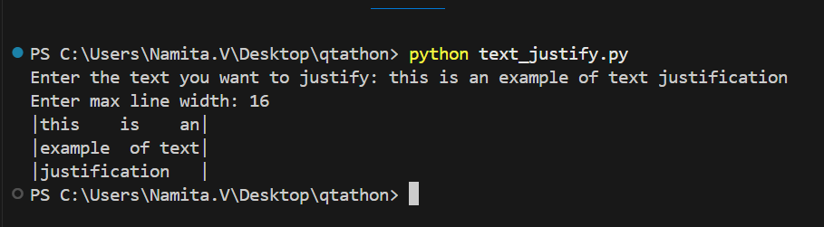
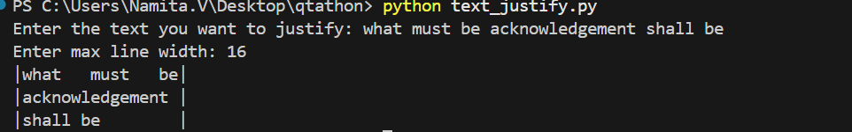
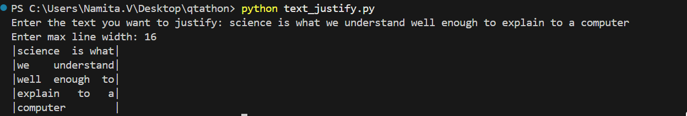
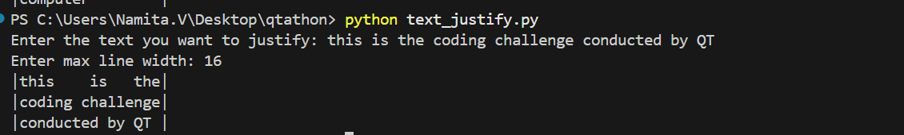

## Text Justification
- **Project Overview:**
The Text Justification Project is a Python-based program developed to align and format text neatly within a specified width, just like professionally printed text in books, magazines, or documents. The main aim of this project is to justify the given text so that each line has uniform width and both the left and right edges appear aligned. The program accepts text input and a maximum line width from the user, processes the words, and adjusts the spaces intelligently to achieve perfect alignment.

The project demonstrates the use of string manipulation, list operations, and logical decision-making in Python. It focuses on how to distribute spaces dynamically between words, ensuring that the total length of each line exactly matches the user-defined maximum width.

- **Implementation Details:**
The implementation begins by taking input from the user — first the text to justify and then the maximum line width. The text is split into individual words and processed sequentially. The program builds lines one by one by adding words until the total length (including spaces) would exceed the allowed width. Once a line is ready, the algorithm calculates the number of spaces needed to fill the line up to the exact width.

If the line contains more than one word, the spaces are evenly distributed between them, and if there are any extra spaces, they are added one by one starting from the leftmost gap. In cases where the line has only one word, the program adds all the remaining spaces to the end of that word. The final line of the text is treated differently — it is left-aligned, meaning words are separated by a single space, and any remaining space is added at the end of the line to maintain consistent width.

To help visualize the alignment, each justified line is displayed within vertical bars (|) when printed. This ensures that users can clearly see how the text fits perfectly within the specified width.

- **Key Features:**
This project provides interactive user input and performs automatic line justification without breaking words. It ensures neat and professional alignment by managing spaces efficiently. The logic used in this program can be applied in real-world text editors, report generators, or any application that requires text formatting and layout control.

## Input Format
The user is prompted to enter two inputs — the text that needs to be justified and an integer representing the maximum width of each line. For example:
Enter the text you want to justify: The quick brown fox jumps over the lazy dog  
Enter max line width: 16

## Output Format

The program outputs the justified text with each line padded or spaced perfectly to match the specified width. Each line is shown between | symbols for clarity.
|The  quick brown|
|fox  jumps  over|
|the   lazy   dog|
Here, every line is exactly 16 characters wide. The first two lines are fully justified, while the last line is left-aligned with extra spaces at the end

## Test cases
Below are the provided test files with their expected outputs.

- **Test case 1:**
 - **data:**
 Enter the text you want to justify: what must be acknowledgement shall be 
 Enter max line width: 16
- **Test case 2:**
 - **data:**
 Enter the text you want to justify: science is what we understand well enough to explain to a computer
 Enter max line width: 16
- **Test cae 3:**
- ** data:**
 Enter the text you want to justify: this is the coding challenge conducted by QT
 Enter max line width: 16
- **Test case 4:**
- **data:**
 Enter the text you want to justify: this is an example of text justification 
 Enter max line width: 16

## Output
 - **Test case 1:**
 |what   must   be|
 |acknowledgement |
 |shall be        |
 

 - **Test case 2:**
 |science  is what|
 |we    understand|
 |well  enough  to|
 |explain   to   a|
 |computer        |
 

- **Test case 3:**
 |this    is   the|
 |coding challenge|
 |conducted by QT |
 

 - **Test case 4:**
 |this    is    an|
 |example  of text|
 |justification   |
 

## File Structure
 task-2                        # Root project folder
│
├── image1.png                   # Screenshot or sample output image (e.g., justified text example)
├── image2.png                   # Additional screenshot for demonstration
├── image3.png                   # Another example or step in the project
├── image4.png                   # Final output or test case screenshot
├── README.md                    # Project documentation file
└── text_justify.py              # Main Python source code file
                                
