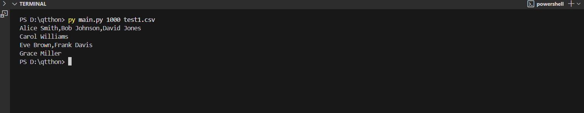
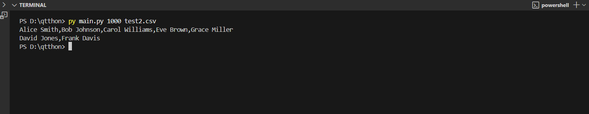
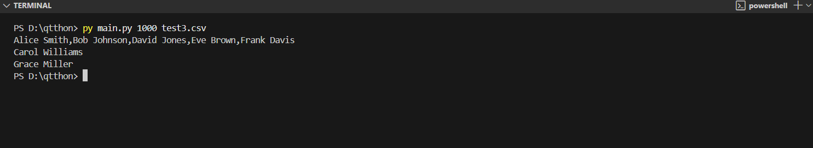

# Neighborhood Grouping System

## Project Overview

This Python program processes a CSV file of citizen data to identify and group people into the minimum number of neighborhoods. The system groups individuals based on 3D proximity (including elevation) or, failing that, by matching ZIP codes.

The implementation uses a greedy clustering algorithm to ensure the "fewest possible neighborhoods" by assigning the first unassigned person as an "anchor" for each new group.

## Implementation Details

### Core Logic

- **Greedy Clustering:** The script iterates through the list of all valid people. The first person not yet assigned to a neighborhood becomes the "anchor" of a new group.
- **Grouping Rules:** This anchor "claims" all other unassigned people by checking two rules in order:
  1.  **Proximity:** Is the other person within the specified 3D distance?
  2.  **ZIP Code:** If not, do they share the exact same ZIP code?
- **Exclusivity:** Once a person is assigned to a neighborhood, they cannot be claimed by another, ensuring each person belongs to only one group.

### 3D Coordinate & Distance Calculation

- **Cartesian Conversion:** To accurately calculate the "shortest line" distance including elevation, each person's (Latitude, Longitude, Elevation) is converted _once_ into 3D Cartesian (X, Y, Z) coordinates.
- **Distance Formula:** The distance between any two people is the standard 3D distance formula: $d = \sqrt{(x_2-x_1)^2 + (y_2-y_1)^2 + (z_2-z_1)^2}$. This avoids complex haversine calculations and correctly accounts for elevation differences.
- **Efficiency:** Coordinates are pre-calculated and stored in a `Person` object to avoid redundant calculations inside the main loop.

### Data Handling

- **`Person` Class:** A `Person` class is used as a clean data structure to store each individual's full name, ZIP code, and their calculated `(x, y, z)` coordinates.
- **CSV Validation:** The script reads the input CSV using a `try...except` block. Any row with invalid or missing data (e.g., non-numeric coordinates) is skipped, per the task requirements.

## Usage

Run the script from the command line, providing the proximity distance (in meters) and the path to the input CSV file as arguments.


python main.py <distance> <input_file.csv>

Input Format
The program expects a CSV file with the following columns:

First Name: Given name

Last Name: Family name

Latitude: North-south position

Longitude: East-west position

Elevation: Meters above sea level

Address: Street address

ZIP code: Postal code

Output Format
The program outputs the grouped neighborhoods to standard output.

Each line represents one neighborhood.

Names within a neighborhood are comma-separated.

Names within each line are sorted alphabetically (A-Z).

The lines themselves are sorted alphabetically by the first name in the list.

Test Cases
Below are the provided test cases with their expected outputs.

Test Case 1: test1.csv (Grouping by ZIP)
Command:

Bash: python main.py 1000 test1.csv


Data:

Code snippet

First Name,Last Name,Latitude,Longitude,Elevation,Address,ZIP code
Alice,Smith,10.7128,-74.0060,10,123 Main St,10001
Bob,Johnson,40.7130,-24.0055,12,456 Elm St,10001
Carol,Williams,30.7142,-74.0070,15,789 Oak St,10002
David,Jones,10.7150,-74.0080,8,321 Pine St,10002
Eve,Brown,74.7165,-74.0090,20,654 Maple St,10003
Frank,Davis,28.7170,-53.0100,18,987 Cedar St,10003
Grace,Miller,40.7180,18.0110,25,159 Spruce St,10004
Output:

Alice Smith,Bob Johnson
Carol Williams,David Jones
Eve Brown,Frank Davis
Grace Miller

Test Case 2: test2.csv (Grouping by Proximity)
Command:

Bash: python main.py 1000 test2.csv

Data:

Code snippet

First Name,Last Name,Latitude,Longitude,Elevation,Address,ZIP code
Alice,Smith,40.7128,-74.0060,10,123 Main St,10001
Bob,Johnson,40.7130,-74.0055,12,456 Elm St,10001
Carol,Williams,40.7142,-74.0070,15,789 Oak St,10002
David,Jones,38.7150,-72.0080,8,321 Pine St,10002
Eve,Brown,40.7165,-74.0090,20,654 Maple St,10003
Frank,Davis,38.7170,-72.0100,18,987 Cedar St,10003
Grace,Miller,40.7180,-74.0110,25,159 Spruce St,10004
Output:

Alice Smith,Bob Johnson,Carol Williams,Eve Brown,Grace Miller
David Jones,Frank Davis
Test Case 3: test3.csv (Testing 3D Elevation)
Command:

Bash: python main.py 1000 test3.csv

Data:

Code snippet

First Name,Last Name,Latitude,Longitude,Elevation,Address,ZIP code
Alice,Smith,40.7128,-74.0060,22,123 Main St,10001
Bob,Johnson,40.7130,-74.0055,1,456 Elm St,10001
Carol,Williams,40.7142,-74.0070,1250,789 Oak St,10002
David,Jones,40.7150,-74.0080,8,321 Pine St,10002
Eve,Brown,40.7165,-74.0090,20,654 Maple St,10003
Frank,Davis,40.7170,-74.0100,18,987 Cedar St,10003
Grace,Miller,40.7180,-74.0110,2500,159 Spruce St,10004
Output:

Alice Smith,Bob Johnson,David Jones,Eve Brown,Frank Davis
Carol Williams
Grace Miller

File Structure: 

task-3/
├── main.py             # Main neighborhood grouping script
├── test1.csv           # Test input 1
├── test2.csv           # Test input 2
├── test3.csv           # Test input 3
├── README.md           # documentation
├── img1.png            # Screenshot for Test Case 1
├── img2.png            # Screenshot for Test Case 2
└── img3.png            # Screenshot for Test Case 3
```
